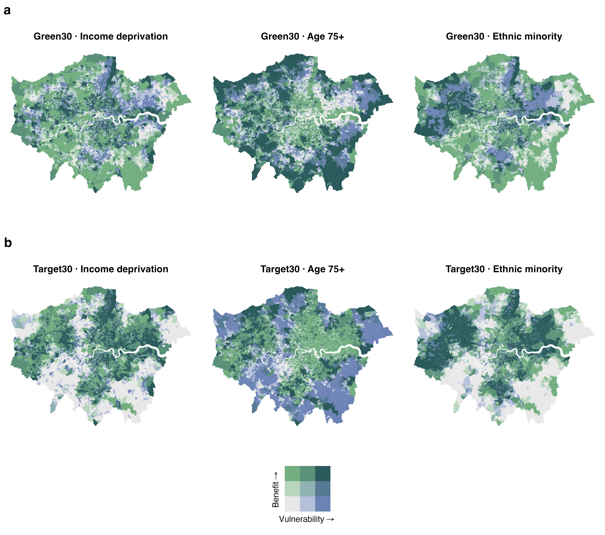
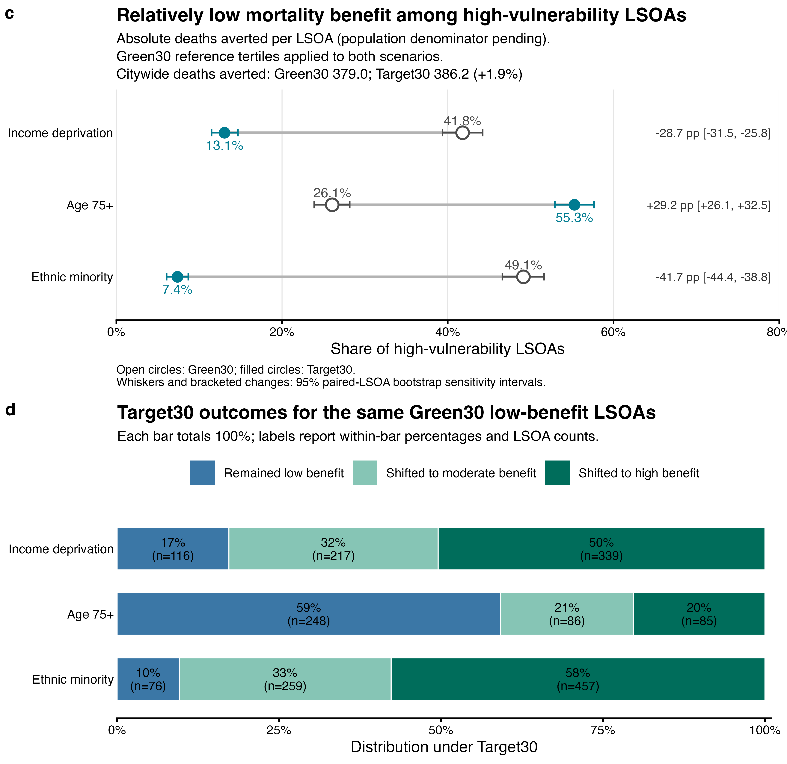

# Urban cooling, health and equity in London

This repository contains the research workflow used to compare how alternative
urban land-cover and tree-planting strategies affect heat exposure, health
outcomes and the distribution of benefits across London neighbourhoods.

The workflow connects four main components:

1. construct baseline and alternative land-cover scenarios;
2. simulate urban cooling with the InVEST Urban Cooling Model;
3. estimate heat-attributable mortality and other co-benefits; and
4. evaluate how benefits are distributed across social-vulnerability groups.

The repository is research code under active manuscript revision. It contains
enough derived data to reproduce the current Figure 7 analysis, but a complete
rebuild from raw data requires access to the project's external geospatial data
store.

Current blockers and the recommended order of work are tracked in
[`TODO.md`](TODO.md).

The effect of replacing the legacy area-weighted mortality surface with the
revised population-weighted workflow is summarized in
[`code/health_assessment/HEALTH_VERSION_COMPARISON.md`](code/health_assessment/HEALTH_VERSION_COMPARISON.md).

## Current analysis convention

All health analyses use **2021 population and 2021 baseline mortality**, even
when the temperature field represents a 2050 climate scenario. Holding
demography constant isolates the effect of climate and land-cover change.

Results must therefore be described as:

> 2050 temperature scenarios evaluated under 2021 population and mortality.

They are not projections of London's population or mortality patterns in 2050.

Use the **25°C setting as the primary manuscript analysis** and the 28°C
setting as a sensitivity analysis. Hold all other health-model inputs and Monte
Carlo settings constant between them.

## Choose the workflow you need

| Goal | Start here | External data required? |
|---|---|---:|
| View the current results | [Figure 7 outputs](#4-inspect-the-outputs) | No |
| See outstanding work and required data | [Project TODO](TODO.md) | No |
| Reproduce Figure 7 | [Quick reproduction of Figure 7](#quick-reproduction-of-figure-7) | No for the current absolute-benefit version; yes for population-normalized results |
| Rerun the health model | [Health assessment](#6-run-the-health-assessment) | Yes |
| Rebuild every scenario and result | [Full end-to-end workflow](#full-end-to-end-workflow) | Yes |
| Check Green30 and Target30 planting equivalence | [Validate intervention budgets](#4-validate-intervention-budgets) | Yes |

## Scenarios

Scenario names used in the analysis are defined centrally in
[`code/func_colors.R`](code/func_colors.R).

| Analysis label | Internal label | Description |
|---|---|---|
| Baseline | `scenario0` | Current/reference land cover |
| AllBuilt | `scenario1` | Counterfactual built-land scenario |
| TreeRisk | `scenario2_TR` | Loss of trees considered at climatic risk |
| TreeOpp | `scenario3_TO` | Tree-planting opportunity scenario |
| Green10/20/30 | `scenario4_10/20/30` | Revised nested proximity-based general-greening scenarios |
| Target10/20/30 | `scenario510/520/530` | Revised ranked vulnerability-targeted planting scenarios |

The Green–Target comparison uses the same definition of existing canopy,
allowed LCM source classes and realized additional canopy, while preserving
Green's area-based design and Target's screened street-candidate design. Transition-level review
found that the earlier audit counted every transition to code 100, including
relabeling woodland codes 1 and 2 and converting ineligible classes. Therefore
the existing UCM, health and Figure 7 outputs are retained as reproducibility
evidence but are not the final equal-area comparison. See the complete
historical lineage and approved regeneration method in
[`code/lc_scenarios/README.md`](code/lc_scenarios/README.md).

## Quick reproduction of Figure 7

This is the shortest fully scripted workflow in the repository.

### 1. Clone the repository

```bash
git clone https://github.com/natcap/urban-cooling-health.git
cd urban-cooling-health
```

### 2. Install the required R packages

The last validated package versions are recorded in
[`fig7_session_info.txt`](figures/equity_map_biscale/fig7_session_info.txt).
Install R and the packages below if they are not already available:

```r
install.packages(c(
  "biscale", "cowplot", "dplyr", "ggplot2", "knitr", "purrr",
  "ragg", "readr", "rmarkdown", "scales", "sf", "tidyr"
))
```

The `sf` and `ragg` packages may require system geospatial and graphics
libraries. A conda-based R environment or the official R installers can be used
when these dependencies are not already present.

### 3. Run the production workflow

From the repository root:

```bash
Rscript code/run-fig7.R
```

The wrapper does not require Pandoc. It validates scenario pairing, duplicate
IDs, missing benefit values and population coverage before producing outputs.

### 4. Inspect the outputs

The workflow writes the following files to
`figures/equity_map_biscale/`:

- `fig7_ab_upgraded.png`: comparable bivariate maps using common thresholds;
- `fig7_cd_upgraded.png`: paired scenario comparison and transition summary;
- `fig7_quantitative_headline_results.csv`: headline equity statistics;
- `fig7_paired_transition_matrix.csv`: exact Green30-to-Target30 transitions;
- `fig7_age75_*.csv`: diagnostic evidence for the age-75+ result;
- `fig7_citywide_tradeoff.csv`: citywide deaths-averted comparison;
- `fig7_run_metadata.csv`: run settings and fixed thresholds; and
- `fig7_session_info.txt`: the R environment used for the run.





### 5. Use the validated 2021 LSOA population lookup

The tracked
[`lsoa_population_2021_by_lsoa11cd.csv`](data/derived/lsoa_population_2021_by_lsoa11cd.csv)
contains positive population estimates for all 4,835 LSOA11 polygons used by
Figure 7. It is keyed by official `LSOA11CD` and was generated from the
count-preserved WorldPop surface with:

```bash
Rscript code/health_assessment/prepare_lsoa_population_2021.R \
  data/derived/fig7_vulnerability_lsoa11_nodata_harmonized.gpkg \
  /path/to/gbr_pop_2021_10m_count_preserved_bng.tif \
  data/derived/lsoa_population_2021_by_lsoa11cd.csv \
  data/derived/lsoa_population_2021_by_lsoa11cd.manifest.json
```

The modeled LSOA total is 8,832,324.67, 0.370% above the official Census 2021
TS001 London total of 8,799,776. The companion manifest records checksums,
software versions, the pixel-centre allocation rule and topology repair for
eight source polygons. The official-code values are exactly identical to the
previous numeric-ID lookup, but sorting or rebuilding upstream tables can no
longer change the join. TS001 uses 4,994 LSOA21 areas and is an external
validation benchmark, not a direct join. `Rscript code/run-fig7.R` reports
deaths averted per 100,000 2021 residents.

For the full Figure 7 protocol, including Monte Carlo files and the final review
checklist, see [`REPRODUCIBILITY.md`](REPRODUCIBILITY.md).

## Full end-to-end workflow

The following sequence reproduces the method from raw spatial inputs. Exact
historical results additionally require the same versioned input rasters and
vectors used in the original runs.

### 1. Prepare the software environments

The workflow currently uses Windows batch files for health-model runs, Python
for raster/vector processing and InVEST, R/R Markdown for statistics and
figures, and Jupyter notebooks for several preprocessing and zonal-statistics
steps.

A practical Python environment includes:

```bash
conda create -n geo_env -c conda-forge \
  python=3.11 geopandas jupyterlab matplotlib numpy pandas pyogrio \
  rasterio shapely
conda activate geo_env
```

Production Urban Cooling runs use InVEST 3.20.2. The older 3.14.1 version
recorded in the historical model-run scripts is retained only for optional
version-comparison checks; do not use it to generate new production results.

The complete R analysis uses additional packages beyond the Figure 7 subset,
including `exactextractr`, `here`, `mgcv`, `performance`, `terra`, `tmap`,
`tidyverse` and `writexl`. Install packages as requested by the relevant R
Markdown file and record the final `sessionInfo()`.

### 2. Assemble and version the input data

Most large project inputs are intentionally not committed. The scripts expect
the following broad input groups:

| Input group | Examples | Main use |
|---|---|---|
| Study boundaries | London borough and LSOA geometries | clipping, zonal statistics and mapping |
| Land cover and tree canopy | baseline LULC, tree-canopy cover and planting opportunities | scenario construction and cooling model |
| Climate | reference evapotranspiration and temperature/UHI settings | InVEST cooling simulations |
| Population | 2021 population raster | health-impact calculation and per-capita equity metrics |
| Mortality | 2021 cause-specific mortality rasters | baseline health burden |
| Buildings | building footprints and energy attributes | energy valuation |
| Vulnerability | income, age, ethnicity, housing and related LSOA indicators | SVI and equity analysis |

Store large data outside Git and preserve an immutable input manifest containing
source, licence, download date, geography vintage, units, CRS, resolution,
checksum and any preprocessing performed. The original scripts commonly expect
the shared-drive structure below:

```text
Wellcome Trust Project Data/
├── 1_preprocess/UrbanCoolingModel/OfficialWorkingInputs/
│   ├── AOIs/
│   ├── LULC/
│   ├── evapotranspiration/
│   ├── pop_raster/
│   ├── health_rasters_10m_bng/
│   └── energy_buildings/
└── 2_postprocess_intermediate/UCM_official_runs/
```

See [`DATA_LICENCE_AND_REDISTRIBUTION.md`](DATA_LICENCE_AND_REDISTRIBUTION.md)
before publishing data or results. WorldPop, ONS/Nomis, ONS boundaries and the
GLA vulnerability layer have documented open terms with attribution. UKCEH
LCM2023 requires confirmation against the licence accepted for this project;
raw/clipped LCM, scenario and UCM rasters must remain outside Git meanwhile.

### 3. Prepare baseline layers and construct scenarios

Run only the components needed for the scenarios under study:

1. Align and clip core layers with
   [`preprocess_and_align_london_layers.py`](code/preprocessing_layers/preprocess_and_align_london_layers.py).
2. Prepare the population surface with
   [`pop_01_prep_clip_reproj.ipynb`](code/preprocessing_layers/pop_01_prep_clip_reproj.ipynb)
   and [`pop_02_resample_for_health_model.py`](code/preprocessing_layers/pop_02_resample_for_health_model.py).
3. Build pavement and tree-opportunity scenarios with
   [`scenario_1_pavement_and_2_opportunity_trees.ipynb`](code/lc_scenarios/scenario_1_pavement_and_2_opportunity_trees.ipynb).
4. Build the tree-risk scenario using the `tree-at-climate-risk-*` scripts in
   [`code/lc_scenarios/`](code/lc_scenarios/).
5. Review the recovered historical Green logs and generate the revised nested
   Green scenarios with
   [`generate_green_scenarios_invest.py`](code/lc_scenarios/generate_green_scenarios_invest.py).
6. Generate Target10/20/30 directly from the final screened ranked points with
   [`generate_target_scenarios.py`](code/lc_scenarios/generate_target_scenarios.py).

**Configuration gate:** checksum verification records the historical selections
as `710v2 -> 510` (Target10), `730v2 -> 520` (Target20), and `730v3 -> 530`
(legacy Target30). The Target20 mapping is intentionally non-sequential. The
legacy polygon generator uses different `710v3/720v3/730v3` defaults, so do
not infer or substitute inputs from their filenames. Use
[`SCENARIO_NAMING_AUDIT.md`](code/health_assessment/SCENARIO_NAMING_AUDIT.md)
as the authoritative crosswalk.

Several older scenario scripts contain machine-specific paths. Review every
input and output path before running them; do not assume the defaults point to
the intended data snapshot.

### 4. Validate intervention areas

Before comparing the revised Green and Target scenarios, run:

```bash
python code/lc_scenarios/validate_green_target_scenarios.py \
  --baseline /path/to/baseline_lulc.tif \
  --green /path/to/Green10.tif /path/to/Green20.tif /path/to/Green30.tif \
  --target /path/to/Target10.tif /path/to/Target20.tif /path/to/Target30.tif \
  --output-json /path/to/green_target_pair_qa.json \
  --output-csv /path/to/green_target_pair_qa.csv
```

The validator treats `{1,2,100}` as existing canopy, permits new planting only
on `{4,20,21}`, checks complete transitions and matches each Target to its
Green count: 307,768, 595,084 and 894,249 cells. Exact regeneration results are
in the scenario README.

### 5. Run the InVEST Urban Cooling Model

Scripts are grouped under
[`code/Urban_Cooling_Modeling_Runs/`](code/Urban_Cooling_Modeling_Runs/).
They accept the external data root as the first argument. For example:

```bash
python code/Urban_Cooling_Modeling_Runs/execute_invest_urban_cooling_model_current_lulc.py \
  "G:/Shared drives/Wellcome Trust Project Data" --eap
```

For the final revised equal-area comparison, validate and run the dedicated
seven-scenario runner. It writes to a new versioned output root and never
overwrites legacy UCM workspaces:

```bash
conda run -n urban-cooling-invest-3.20.2 python \
  code/Urban_Cooling_Modeling_Runs/execute_invest_urban_cooling_model_revised_scenarios.py \
  /path/to/Wellcome\ Trust\ Project\ Data --validate-only

# After all configurations validate, rerun without --validate-only.
```

The dedicated Target30 v4 runner preserves the legacy `scenario530` outputs
and runs the 25°C primary and 28°C sensitivity settings in a separate
health-only workspace:

```bash
python code/Urban_Cooling_Modeling_Runs/execute_invest_urban_cooling_model_target30_equal_budget.py \
  /path/to/Wellcome\ Trust\ Project\ Data
```

This runner reproduces the historical code-100-matched v4 analysis only. Keep
it for provenance; use the revised seven-scenario runner above for the final
comparison.

The default omits productivity and building-energy valuation because neither
affects the air-temperature raster used by the health model. Add
`--include-valuations` only when those additional outputs are required; they
substantially increase runtime.

Run the matching baseline and Green30 health inputs with the production runner:

```bash
python code/Urban_Cooling_Modeling_Runs/execute_invest_urban_cooling_model_health_scenarios.py \
  /path/to/Wellcome\ Trust\ Project\ Data --validate-only
```

After validation, remove `--validate-only`. The runner enforces InVEST 3.20.2,
refuses to overwrite completed outputs, and writes input checksums, model
arguments, grid metadata and software versions beside every result.

Create the production environment from conda-forge, which resolves InVEST and
its compiled geospatial dependencies together:

```bash
conda env create \
  -f code/Urban_Cooling_Modeling_Runs/environment-invest-3.20.2.yml
conda run -n urban-cooling-invest-3.20.2 \
  python code/Urban_Cooling_Modeling_Runs/execute_invest_urban_cooling_model_target30_equal_budget.py \
  /path/to/Wellcome\ Trust\ Project\ Data --validate-only
```

The verified Apple Silicon installation resolves to InVEST 3.20.2, Python
3.12, GDAL 3.12.4 and pygeoprocessing 2.4.11. Preserve the conda environment
export with final run metadata. InVEST 3.20.2 writes `T_air` in the workspace
root; the health configuration already uses this location. Run the command
without `--validate-only` only after both temperature settings pass validation.

For an exact comparison with historical model behavior only, see
`environment-invest-3.14.1.yml` and clearly label those outputs as historical.
The observed version check and the rule against mixing versions within a health
comparison are documented in
[`INVEST_VERSION_COMPARISON.md`](code/Urban_Cooling_Modeling_Runs/INVEST_VERSION_COMPARISON.md).

Run the baseline and every required scenario with identical model settings.
Target10/20/30 scripts are in
[`Scenario_510_to_530_runs/`](code/Urban_Cooling_Modeling_Runs/Scenario_510_to_530_runs/).
Check each script's `variables` array, land-cover path, model parameters and
output suffix before execution.

### 6. Run the health assessment

Detailed health-model notes are in
[`code/health_assessment/README.md`](code/health_assessment/README.md).
Data-selection and allocation decisions are documented in
[`code/health_assessment/DATA_SELECTION_AND_METHOD_DECISIONS.md`](code/health_assessment/DATA_SELECTION_AND_METHOD_DECISIONS.md).

1. Generate `mortality_2021_long.csv` from the project's original 2021 Nomis
   TSV export as documented in the
   [health-assessment guide](code/health_assessment/README.md), then allocate
   them by 2021 pixel population with
   [`prepare_mortality_population_weighted.py`](code/health_assessment/prepare_mortality_population_weighted.py).
   The earlier area-weighted
   [`health-model-01-prep-input-ONS-mortality-data.Rmd`](code/health_assessment/health-model-01-prep-input-ONS-mortality-data.Rmd)
   remains available only for comparison until the revised results are approved.
2. Create the count-preserved EPSG:27700 population raster directly from the
   raw WorldPop count raster with
   [`prepare_population_2021_count_preserved.py`](code/health_assessment/prepare_population_2021_count_preserved.py).
   Do not use the older `gbr_pop_2021_10m_areal.tif`: its upstream bilinear
   reprojection reduced the London total from about 8.8 million to 4.74
   million. Confirm that temperature, corrected population and revised
   mortality rasters share the intended grid, extent and units.
3. After the six revised Green/Target LULC rasters pass the scenario gates,
   validate and run their 25°C and 28°C pairs with `health_modeling_v2.py`.
   The current configuration reproduces the historical code-100-matched
   Green30/Target30 v4 analysis and must be updated before the final rerun.
4. Use 2,000 paired cause-stable draws and seed `20260908`, as recorded in
   `health-analysis-v2.example.json`. Legacy Windows batch launchers are kept
   only for historical comparison.

The health model produces aligned temperature differences, attributable
fractions, cause-specific excess-death rasters, deterministic city totals and
Monte Carlo draw files.

### 7. Calculate zonal statistics

For the revised health workflow, run
[`prepare_health_lsoa_zonal_stats.py`](code/health_assessment/prepare_health_lsoa_zonal_stats.py).
It aggregates all four production cases, restores official `LSOA11CD`, verifies
one-to-one geography matching, requires complete valid-cell assignment and
writes a provenance manifest. The earlier
[`health-modeling-zonal-stats.ipynb`](code/health_assessment/health-modeling-zonal-stats.ipynb)
is retained for legacy outputs only.

Other service outputs use:

- [`invest_result_zonal_stats_temp.ipynb`](code/invest_result_zonal_stats_temp.ipynb)
- [`invest_result_zonal_stats_energy.ipynb`](code/invest_result_zonal_stats_energy.ipynb)
- [`invest_result_zonal_stats_productivity.ipynb`](code/invest_result_zonal_stats_productivity.ipynb)

### 8. Build vulnerability indicators

Run [`socio-economic-data.Rmd`](code/socio-economic-data.Rmd) to clean LSOA
vulnerability metrics and construct the composite SVI. Preserve the official
LSOA code in future rebuilds; the current derived object also contains a numeric
row-order ID retained for compatibility.

### 9. Produce analysis and manuscript figures

| Output | Main script |
|---|---|
| Climate context / Figure 1 | [`gcm-data-clip-stats-viz.Rmd`](code/gcm-data-clip-stats-viz.Rmd) |
| Temperature and canopy equity / Figure 2 | [`equity-temp-tcc.Rmd`](code/equity-temp-tcc.Rmd) |
| Temperature results / Figure 3 | [`invest_result_zonal_viz_1_temp.Rmd`](code/invest_result_zonal_viz_1_temp.Rmd) |
| Energy, productivity and health summaries / Figures 4–5 | the `invest_result_zonal_viz_*`, health-output and [`viz-es-change-due-to-lc.Rmd`](code/viz-es-change-due-to-lc.Rmd) workflows |
| Health-equity models / Figure 6 and supplementary table | [`equity-health.Rmd`](code/equity-health.Rmd) |
| Paired Green30–Target30 equity comparison / Figure 7 | [`equity-health-fig7-production.Rmd`](code/equity-health-fig7-production.Rmd), preferably through [`run-fig7.R`](code/run-fig7.R) |

Treat [`equity-health-fig7-upgrade.Rmd`](code/equity-health-fig7-upgrade.Rmd)
as an archived August 2026 workflow. It is retained for audit history, not as
the current production script.

### 10. Apply review gates before reporting results

Do not treat a successful script run as sufficient validation. Confirm:

1. input provenance, years, units, CRS and raster alignment are recorded;
2. scenario names map to the intended LULC and temperature rasters;
3. Green30 and Target30 pass the realized-canopy budget check;
4. health estimates explicitly state the fixed-2021-demography convention;
5. LSOA joins are one-to-one and contain all 4,835 expected areas;
6. population-normalized results use a complete 2021 population lookup;
7. uncertainty statements distinguish paired-LSOA sensitivity intervals from
   exposure-response Monte Carlo uncertainty; and
8. final figures and tables are visually inspected and agree with their saved
   source CSVs.

## Repository map

```text
urban-cooling-health/
├── README.md                         # project entry point
├── TODO.md                           # prioritized blockers and next actions
├── REPRODUCIBILITY.md                 # detailed Figure 7 protocol
├── data/
│   └── derived/                      # small documented Figure 7 inputs
├── figures/
│   └── equity_map_biscale/           # Figure 7 data, figures and metadata
├── code/
│   ├── preprocessing_layers/        # align and prepare spatial inputs
│   ├── lc_scenarios/                # construct and validate LULC scenarios
│   ├── Urban_Cooling_Modeling_Runs/ # execute InVEST UCM scenarios
│   ├── health_assessment/           # mortality model and zonal statistics
│   ├── post_processing_layers/      # aggregate model outputs
│   ├── equity-health.Rmd            # broader health-equity analysis
│   └── run-fig7.R                  # portable Figure 7 entry point
└── LICENSE
```

## Reproducibility status and limitations

- **Historical Figure 7:** directly runnable from the tracked, documented
  vulnerability, LSOA health, 2021 population and paired-draw inputs under
  `data/derived/`; it predates the common-eligibility scenario correction.
- **Historical UCM and health rerun:** validated on InVEST 3.20.2 for baseline,
  Green30 and code-100-matched Target30 v4 at 25°C and 28°C.
- **Final equal-area comparison:** pending construction and review of all six
  common-eligibility Green/Target rasters.
- **Full model chain:** requires external raw and intermediate geospatial data
  that are not stored in this repository.
- **Historical result recreation:** requires the original versioned input
  snapshots, not merely datasets with the same names.
- **Portability:** several legacy scripts still contain Windows/shared-drive
  paths and should be reviewed before use on another computer.

## Contributing and reporting issues

When proposing a change, state which scenario, data snapshot and output it
affects. Keep generated headline tables synchronized with their figures, retain
run metadata, and avoid committing private or licence-restricted source data.
Use the repository's GitHub issue tracker for questions or reproducibility
problems.

## Licence

See [`LICENSE`](LICENSE).
